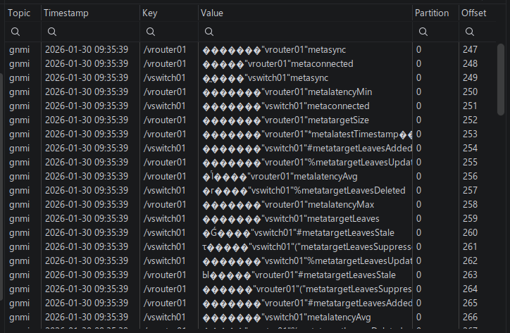

# Arista cEOS containerlab lab

## Virtual network devices

The cEOS devices are orchestrated by containerlab and deployed as Docker
containers. If Docker is already managing other containers (e.g.: Pi-Hole),
making the cEOS containers accessible from outside the host becomes a
challenge. The iptables rules created by containerlab conflict with
those of Docker, and the other containers become inaccessible from outside
the host. Neither `host` nor `macvlan` networking modes are viable options
in this scenario.

The path of least resistence is to create virtual IP addresses on the host
and proxy those to the containerlab devices. If using the standard ssh
ports for the cEOS devices, these conflict with the host's ssh service,
as it is controlled by systemd and bound to all interfaces, including the
virtual IP addresses. One possible solution is to disable the ssh.socket
unit and enable the ssh.service unit instead. You can then bind the host's
ssh service using sshd_config. The proxy service used here is `rinetd`.

### virtual IP addresses

On this system, netplan is used to configure networking. Note that
the VIPs must be /32 addresses:

```yaml
network:
  version: 2
  ethernets:
    enp1s0:
      addresses:
        - "192.168.3.24/24"
        - "192.168.3.242/32"
        - "192.168.3.243/32"
```

### sshd service

We need to disable the ssh.socket unit and enable the ssh.service unit:

```shell
$ systemctl disable --now ssh.socket
$ systemctl enable --now ssh.service
$ systemctl restart ssh
$ systemctl restart rinetd
```

### rinetd configuration

We need access to both ssh and gnmi ports on each cEOS device:

```text
192.168.3.242	22	    172.24.78.11	22
192.168.3.242	6030	172.24.78.11	6030
192.168.3.243	22	    172.24.78.12	22
192.168.3.243	6030	172.24.78.12	6030
```

### containerlab topology

```yaml
---
name: "ceos-lab"
prefix: ""

mgmt:
  network: "network-lab"
  ipv4-subnet: "172.24.78.0/24"

topology:
  kinds:
    ceos:
      image: "ceos:4.32.0F"

  nodes:
    bos-acc-01:
      kind: "ceos"
      mgmt-ipv4: "172.24.78.12"
      startup-config: "startup-configs/bos-acc-01.conf"

    bos-rtr-01:
      kind: "ceos"
      mgmt-ipv4: "172.24.78.11"
      startup-config: "startup-configs/bos-rtr-01.conf"

  links:
    - endpoints: ["bos-acc-01:eth1", "bos-rtr-01:eth1"]
```

Startup and shutdown:

```shell
containerlab deploy --topo ceos-lab.clab.yml --node-filter bos-acc-01,bos-rtr-01
containerlab destroy --topo ceos-lab.clab.yml --node-filter bos-acc-01,bos-rtr-01
```


### For streaming telemetry

```text
ceos-02(config)#management api gnmi
ceos-02(config-mgmt-api-gnmi)#transport grpc default
ceos-02(config-mgmt-api-gnmi)#provider eos-native
```

Sidebar ... if you want to interact directly with the devices using Netmiko:

```python
from netmiko import ConnectHandler
net_connect = ConnectHandler(
  device_type="arista_eos",
  host="172.17.0.2",
  username="****",
  password="****"
)

net_connect
<netmiko.arista.arista.AristaSSH object at 0x7abfa8bbf610>

net_connect.find_prompt()
'ceos-01>'


output = net_connect.send_command("show version")
>>> print(output)
Arista cEOSLab
Hardware version: 
Serial number: 7579A68E1C5B921AA01EA5A60E12FCD5
Hardware MAC address: 001c.7314.b2a8
System MAC address: 001c.7314.b2a8

Software image version: 4.32.0F-36401836.4320F (engineering build)
Architecture: x86_64
Internal build version: 4.32.0F-36401836.4320F
Internal build ID: e97bbe15-478c-45d1-84fa-3323aef84
Image format version: 1.0
Image optimization: None

cEOS tools version: (unknown)
Kernel version: 6.5.0-1025-azure

Uptime: 4 minutes
Total memory: 8119864 kB
Free memory: 1232352 kB
```

## testing gRPC with grpcurl

```shell
$ grpcurl -plaintext -H "username:****" -H "password:****" vrouter01.lavacro.net:6030 list
gnmi.gNMI
gnoi.certificate.CertificateManagement
gnoi.factory_reset.FactoryReset
gnoi.file.File
gnoi.os.OS
gnoi.packet_link_qualification.LinkQualification
gnoi.system.System
grpc.reflection.v1.ServerReflection
grpc.reflection.v1alpha.ServerReflection
```

## gnmic

I spent a significant amount of time attempting to get `gnmi-gateway` working
to no avail. As an alternative, I used `gnmic` to subscribe to gNMI telemetry
and publish the data to Kafka.

Installation is a one-liner; you will require `sudo` access to install the binary:

```shell
$ bash -c "$(curl -sL https://get-gnmic.openconfig.net)"
```

You can validate by subscribing to one target:

```shell
$ gnmic subscribe \
  --address vrouter01.lavacro.net:6030 \
  --username **** \
  --password **** \
  --insecure \
  --mode stream \
  --sample-interval 10s \
  --path /interfaces/interface/state/counters \
  --path /system/state/current-datetime
```

Create `config.yml`:

```yaml
subscriptions:
  if_counters:
    paths:
      - /interfaces/interface/state/counters
    mode: stream
    sample-interval: 10s

  heartbeat:
    paths:
      - /system/state/current-datetime
    mode: stream
    sample-interval: 30s

targets:
  vrouter01:
    address: vrouter01.lavacro.net:6030
    username: ****
    password: ****
    insecure: true
    subscriptions:
      - if_counters
      - heartbeat
  vswitch01:
    address: vswitch01.lavacro.net:6030
    username: ****
    password: ****
    insecure: true
    subscriptions:
      - if_counters
      - heartbeat

outputs:
  kafka_prod:
    type: kafka
    address: kafka.lavacro.net:9092
    topic: gnmi
    format: json
```

Run `gnmic` (with logging enabled):

```shell
$ gnmic subscribe --config gnmic.yml --log
```

Verification (via IntelliJ's Kafka plugin):

