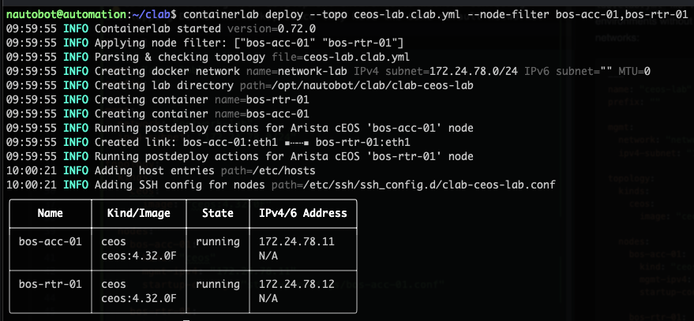

# Arista cEOS containerlab lab

## Virtual network devices

The cEOS devices are orchestrated by containerlab and deployed as Docker
containers. If Docker is already managing other containers (e.g.: Pi-Hole),
making the cEOS containers accessible from outside the host becomes a
challenge. The iptables rules created by containerlab conflict with
those of Docker, and the other containers become inaccessible from outside
the host.

The path of least resistence is to create virtual IP addresses on the host
and proxy those to the containerlab devices. If using the standard ssh
ports for the cEOS devices, these conflict with the host's ssh service,
as it is controlled by systemd and bound to all interfaces, including the
virtual IP addresses. One possible solution is to disable the ssh.socket
unit and enable the ssh.service unit instead. You can then bind the host's
ssh service using sshd_config. The proxy service used here is `rinetd`.

### Create virtual IP addresses on host

```yaml
network:
  version: 2
  ethernets:
    enp1s0:
      addresses:
        - "192.168.3.24/24"
        - "192.168.3.242/32"
        - "192.168.3.243/32"
```

### sshd service

```shell
systemctl disable --now ssh.socket
systemctl enable --now ssh.service
systemctl restart ssh
systemctl restart rinetd
```

### rinetd configuration, ssh and gnmi ports

```text
192.168.3.242	22	    172.24.78.11	22
192.168.3.242	6030	172.24.78.11	6030
192.168.3.243	22	    172.24.78.12	22
192.168.3.243	6030	172.24.78.12	6030
```

### containerlab topology

```yaml
---
name: "ceos-lab"
prefix: ""

mgmt:
  network: "network-lab"
  ipv4-subnet: "172.24.78.0/24"

topology:
  kinds:
    ceos:
      image: "ceos:4.32.0F"

  nodes:
    bos-acc-01:
      kind: "ceos"
      mgmt-ipv4: "172.24.78.12"
      startup-config: "startup-configs/bos-acc-01.conf"

    bos-rtr-01:
      kind: "ceos"
      mgmt-ipv4: "172.24.78.11"
      startup-config: "startup-configs/bos-rtr-01.conf"

  links:
    - endpoints: ["bos-acc-01:eth1", "bos-rtr-01:eth1"]
```

Startup and shutdown:

```shell
containerlab deploy --topo ceos-lab.clab.yml --node-filter bos-acc-01,bos-rtr-01
containerlab destroy --topo ceos-lab.clab.yml --node-filter bos-acc-01,bos-rtr-01
```



### For streaming telemetry

```text
ceos-02(config)#management api gnmi
ceos-02(config-mgmt-api-gnmi)#transport grpc default
ceos-02(config-mgmt-api-gnmi)#provider eos-native
```

Interacting directly with the devices using Netmiko:

```python
from netmiko import ConnectHandler
net_connect = ConnectHandler(
  device_type="arista_eos",
  host="172.17.0.2",
  username="****",
  password="****"
)

net_connect
<netmiko.arista.arista.AristaSSH object at 0x7abfa8bbf610>

net_connect.find_prompt()
'ceos-01>'


output = net_connect.send_command("show version")
>>> print(output)
Arista cEOSLab
Hardware version: 
Serial number: 7579A68E1C5B921AA01EA5A60E12FCD5
Hardware MAC address: 001c.7314.b2a8
System MAC address: 001c.7314.b2a8

Software image version: 4.32.0F-36401836.4320F (engineering build)
Architecture: x86_64
Internal build version: 4.32.0F-36401836.4320F
Internal build ID: e97bbe15-478c-45d1-84fa-3323aef84
Image format version: 1.0
Image optimization: None

cEOS tools version: (unknown)
Kernel version: 6.5.0-1025-azure

Uptime: 4 minutes
Total memory: 8119864 kB
Free memory: 1232352 kB
```

## gnmi gateway

```shell
$ git clone https://github.com/openconfig/gnmi-gateway.git
$ cd gnmi-gateway
$ make tls
openssl ecparam -genkey -name secp384r1 -out server.key
openssl req -new -x509 -sha256 -key server.key -out server.crt -days 3650 -subj "/CN=selfsigned.gnmi-gateway.local"
$ cp targets-example.yaml targets.yaml
```

Edit targets.yaml with the actual target devices.

```shell
$ make build
rm -f gnmi-gateway
rm -f cover.out
go build -o gnmi-gateway -ldflags "-X github.com/openconfig/gnmi-gateway/gateway.Version="v0.12.0-97c850f" -X github.com/openconfig/gnmi-gateway/gateway.Buildtime=2026-01-25T02:11:42Z" .
go: downloading github.com/kelseyhightower/envconfig v1.4.0
go: downloading github.com/Netflix/spectator-go v0.1.3
go: downloading github.com/go-zookeeper/zk v1.0.2
...
go: downloading github.com/go-openapi/jsonreference v0.19.3
go: downloading github.com/PuerkitoBio/purell v1.1.1
go: downloading github.com/PuerkitoBio/urlesc v0.0.0-20170810143723-de5bf2ad4578
./gnmi-gateway -version
gnmi-gateway version v0.12.0-97c850f (Built 2026-01-25T02:11:42Z)
$ ./gnmi-gateway -EnableGNMIServer \
    -ServerTLSCert=server.crt \
    -ServerTLSKey=server.key \
    -TargetLoaders=simple \
    -TargetJSONFile=targets.yaml \
    -Exporters=debug
```
