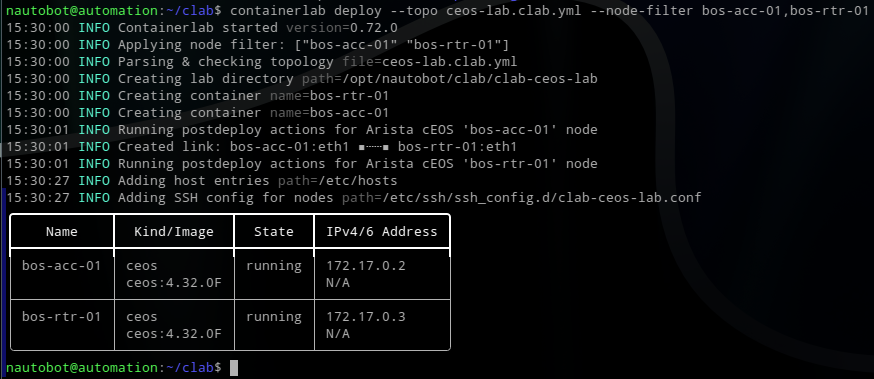

# Nautobot


## Installation

### PostGreSQL


```postgresql
CREATE DATABASE nautobot;
CREATE USER nautobot WITH PASSWORD '*****';
GRANT ALL PRIVILEGES ON DATABASE nautobot TO nautobot;
\connect nautobot
GRANT CREATE ON SCHEMA public TO nautobot;
\q
```

### Virtual network devices

```shell
containerlab deploy --topo ceos-lab.clab.yml --node-filter bos-acc-01,bos-rtr-01
containerlab destroy --topo ceos-lab.clab.yml --node-filter bos-acc-01,bos-rtr-01
```



```python
from netmiko import ConnectHandler
net_connect = ConnectHandler(
  device_type="arista_eos",
  host="172.17.0.2",
  username="****",
  password="****"
)

net_connect
<netmiko.arista.arista.AristaSSH object at 0x7abfa8bbf610>

net_connect.find_prompt()
'ceos-01>'


output = net_connect.send_command("show version")
>>> print(output)
Arista cEOSLab
Hardware version: 
Serial number: 7579A68E1C5B921AA01EA5A60E12FCD5
Hardware MAC address: 001c.7314.b2a8
System MAC address: 001c.7314.b2a8

Software image version: 4.32.0F-36401836.4320F (engineering build)
Architecture: x86_64
Internal build version: 4.32.0F-36401836.4320F
Internal build ID: e97bbe15-478c-45d1-84fa-3323aef84
Image format version: 1.0
Image optimization: None

cEOS tools version: (unknown)
Kernel version: 6.5.0-1025-azure

Uptime: 4 minutes
Total memory: 8119864 kB
Free memory: 1232352 kB
```

## upgrade

```shell
$ pip install --upgrade nautobot
$ pip install -U nautobot-device-onboarding nautobot-golden-config nautobot-dns-models nautobot-plugin-nornir nautobot-capacity-metrics nautobot-ssot

$ nautobot-server collectstatic
$ nautobot-server migrate

$ systemctl restart nautobot nautobot-worker nautobot-scheduler
```