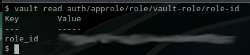

# Hashicorp Vault

```shell
$ export VAULT_ADDR=http://127.0.0.1:8201

$ vault write auth/approle/role/vault-role \
    secret_id_ttl=0 \
    token_num_uses=0 \
    token_ttl=1h \
    token_max_ttl=4h \
    policies="lavacro_prod"
```



$ vault read auth/approle/role/vault-role/role-id

$ vault write -f auth/approle/role/vault-role/secret-id


## Vault Policies

### Read/Write Secret Values
path "lavacro/data/prod/*" {
  capabilities = ["create", "read", "update", "delete", "list"]
}

### Allow listing, deleting versions, metadata
path "lavacro/metadata/prod/*" {
  capabilities = ["read", "list", "delete"]
}

# The standard KV V2 data path
path "lavacro/data/prod/*" {
capabilities = ["read", "list"]
}

# The path as seen by the application request
path "lavacro/prod/*" {
capabilities = ["read", "list"]
}


$ vault write auth/approle/login 


VAULT_TOKEN="***" vault kv get lavacro/prod/database/postgresql


Generate a new one (vault write -f auth/approle/role/vault-role/secret-id).

Update the script.

Revoke the old one using its accessor.

$ VAULT_TOKEN="hvs.******" vault kv get lavacro/prod/database/postgresql
Error making API request.
