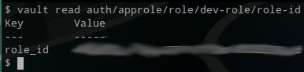
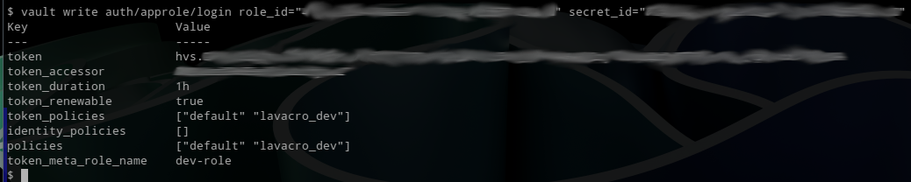

# Hashicorp Vault

The “vault” command must be run on a machine with access to the
Vault server. In these examples, it is run locally and requires
that the `VAULT_ADDR` environment variable be set:

```shell
$ export VAULT_ADDR=http://127.0.0.1:8201
```

From the Vault UI, define policies:


Create an AppRole auth method. The name of the role
in this example is `dev-role` and maps to the `lavacro_dev` policy:

```shell
$ vault write auth/approle/role/dev-role \
    secret_id_ttl=0 \
    token_num_uses=0 \
    token_ttl=1h \
    token_max_ttl=4h \
    policies="lavacro_dev"
```

Obtain the generated RoleID:

$ vault read auth/approle/role/dev-role/role-id



Create a SecretID for the AppRole:

```shell
$ vault write -f auth/approle/role/vault-role/secret-id
```


Validate that the RoleID and SecretID can be used to obtain
a token:

```shell
$ vault write auth/approle/login role_id="{ROLE_ID}" secret_id="{SECRET_ID}"
```


